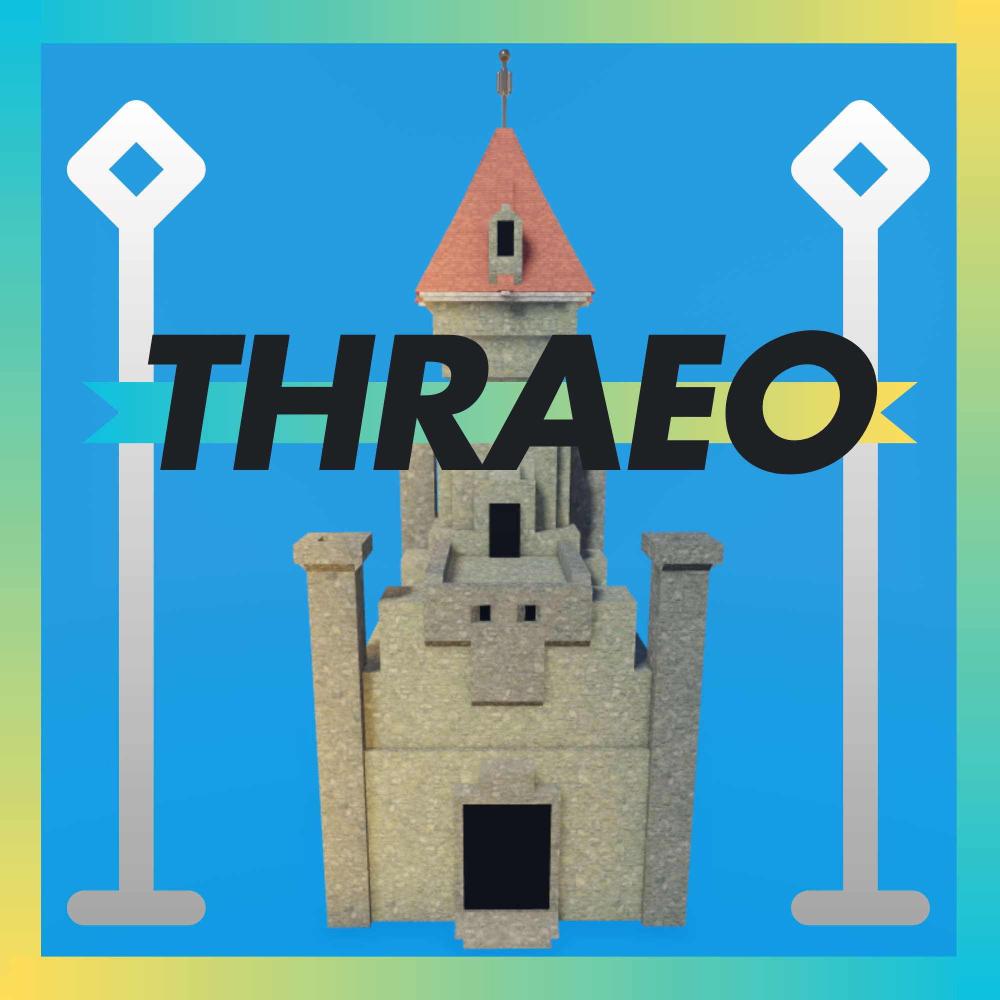

[![Contributors][contributors-shield]][contributors-url]
[![Forks][forks-shield]][forks-url]
[![Stargazers][stars-shield]][stars-url]
[![Issues][issues-shield]][issues-url]
[![MIT License][license-shield]][license-url]
[![LinkedIn][linkedin-shield]][linkedin-url]

 

  

<h3 align="center">Thraeo</h3>

    A strategic castle-building and hero-leveling game inspired by Starrows
     
    <a href="https://www.roblox.com/games/97238312755881/Thraeo">View Game</a>
    ·
    <a href="https://github.com/IsaacSShade/Thraeo/issues">Report Bug</a>
    ·
    <a href="https://github.com/IsaacSShade/Thraeo/issues">Request Feature</a>
  

<!-- TABLE OF CONTENTS -->

  
Table of Contents

  <ol>
    <li>
      <a href="#about-the-project">About The Project</a>
      <ul>
        <li><a href="#built-with">Technologies the project is built with</a></li>
      </ul>
    </li>
    <li><a href="#screenshots">Screenshots</a></li>
    <li><a href="#roadmap">Roadmap</a></li>
    <li><a href="#license">License</a></li>
    <li><a href="#acknowledgments">Acknowledgments</a></li>
  </ol>

<!-- ABOUT THE PROJECT -->

## About The Project

Thraeo is a tactical, strategic game inspired by the lesser-known mobile game, Starrows. Players select unique champions with different types of flair for greater strategy. They'll level up, battle enemy factions, and strategically build defenses and armies in their castle. The ultimate goal: protect your king and eliminate enemy kingdoms by spearheading massive armies into epic battles.

([Link to game](!https://www.roblox.com/games/97238312755881/Thraeo))

### Features:

* Strategic castle-building mechanics
* Hero leveling and progression
* Diverse units including Archers, Wizards, and elite guards
* Dynamic combat and pathfinding system
* Reward system based on unit and hero kills

(<a href="#top">back to top</a>)

### Built With

This section below contains the major frameworks/libraries used to create Thraeo.

* Luau
* Roblox Studio
* Blender
* Rojo (for syncing the project to GitHub)

(<a href="#top">back to top</a>)

<!-- SCREENSHOTS -->

## Screenshots

Placeholder for screenshots showcasing game mechanics, champions, and battles.

    ">

    ">

    ">

(<a href="#top">back to top</a>)

<!-- ROADMAP -->

## Roadmap

* [x] Core gameplay mechanics (building, unit management)
* [ ] Squad-based pathfinding optimization
* [ ] Hero progression and abilities
* [ ] Dynamic NPC spawning and interactions
* [ ] UI polish and player experience enhancements

See the [open issues](https://github.com/IsaacSShade/Thraeo/issues) for a full list of proposed features and known issues.

(<a href="#top">back to top</a>)

<!-- LICENSE -->

## License

Distributed under the MIT License. See `LICENSE.txt` for more information.

(<a href="#top">back to top</a>)

<!-- ACKNOWLEDGMENTS -->

## Acknowledgments

Roblox game made by

* Aiden Tabrah

Special thanks to

* Arkounay who created the inspiration, [Starrows](https://play.google.com/store/apps/details?id=com.outerark.starrows&hl=en_US)

(<a href="#top">back to top</a>)

<!-- MARKDOWN LINKS & IMAGES -->

[contributors-shield]: https://img.shields.io/github/contributors/IsaacSShade/Thraeo.svg?style=for-the-badge
[contributors-url]: https://github.com/IsaacSShade/Thraeo/graphs/contributors
[forks-shield]: https://img.shields.io/github/forks/IsaacSShade/Thraeo.svg?style=for-the-badge
[forks-url]: https://github.com/IsaacSShade/Thraeo/network/members
[stars-shield]: https://img.shields.io/github/stars/IsaacSShade/Thraeo.svg?style=for-the-badge
[stars-url]: https://github.com/IsaacSShade/Thraeo/stargazers
[issues-shield]: https://img.shields.io/github/issues/IsaacSShade/Thraeo.svg?style=for-the-badge
[issues-url]: https://github.com/IsaacSShade/Thraeo/issues
[license-shield]: https://img.shields.io/github/license/IsaacSShade/Thraeo.svg?style=for-the-badge
[license-url]: https://github.com/IsaacSShade/Thraeo/blob/main/LICENSE.txt
[linkedin-shield]: https://img.shields.io/badge/-LinkedIn-black.svg?style=for-the-badge&logo=linkedin&colorB=555
[linkedin-url]: https://www.linkedin.com/in/aiden-tabrah/
